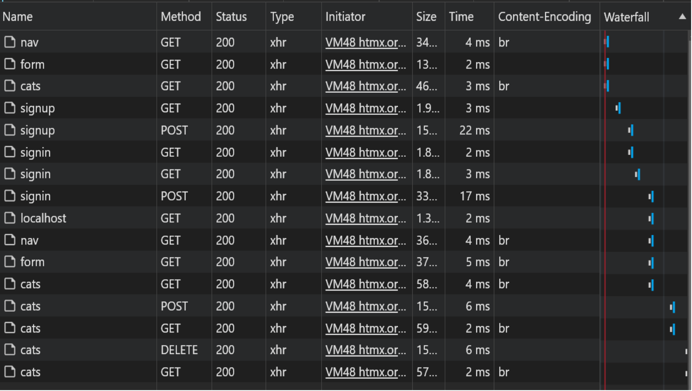

# rust-axum-htmx-example

This is a web application built with Rust with Axum and HTMX. It provides a set of APIs for managing cats and user authentication.

## Tech Stack

### Backend

The backend of this application is built with Rust using the Axum framework. Axum is a blazingly fast web application framework.

We use LibSQL (fork of SQLite) for the database, which is accessed using the `libsql` crate. For environment variable management, we use the `dotenv` crate.

For templating, we use the Sailfish template engine. Sailfish is a fast and minimalistic template engine for Rust. It's designed to be simple.

### Frontend

The frontend of this application is built using HTMX for dynamic HTML content. HTMX allows us to access modern browser features directly from HTML, without requiring a separate JavaScript framework by swapping out HTML from the server response.

PicoCSS was used for styling.

## Project Structure

The project is organized into several directories:

- `src/`: Contains the Rust source code for the server.
- `frontend/`: Contains the frontend code written in TypeScript.
- `templates/`: Contains the server-side templates.

## Getting DEV Started

1. Clone the repository:

```bash
git clone <repository-url>
```

2. Navigate to the root directory:

```bash
cd rust-axum-htmx-example/
```

## To run the backend

3. Set the environment variable in the .env file:

```
SERVER_URL=IP:PORT
SECRET=secret
```

4. Install the dependencies:

```bash
cargo build
```

5. Run the server:

```bash
cargo run
```

## To run the frontend

6. Navigate to the frontend directory:

```bash
cd rust-axum-htmx-example/frontend
```

7. Install the dependencies:

```bash
pnpm install
```

8. Run the frontend:

```bash
pnpm dev
```

## Performance

As we can see all basic CRUD operations + template rendering is blazingly fast and so is the auth part.

